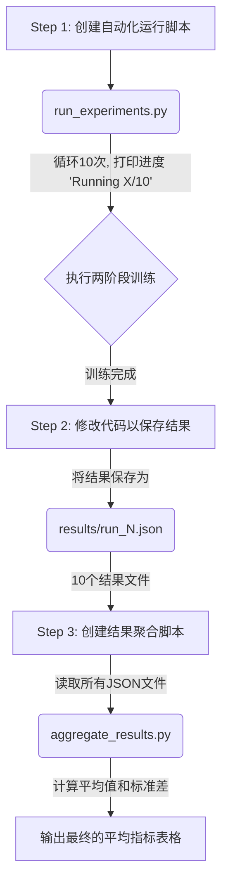

# 实验复现计划

本计划旨在复现论文 "Learn to Adapt for Generalized Zero-Shot Text Classification" 的核心实验结果。

## 阶段一：单次运行复现 (已完成)

- **目标**: 成功运行 `Clinc` 数据集的两阶段训练，并得到初步结果。
- **状态**: ✅ 已完成。我们成功配置了环境，解决了依赖问题，并完成了 `Clinc` 数据集的单次完整训练，验证了代码的可行性。

## 阶段二：SNIPS 数据集复现尝试 (已中止)

- **目标**: 在 `SNIPS` 数据集上复现实验结果。
- **状态**: ❌ 已中止。在尝试运行第二阶段训练时，遇到了持续的 `CUDA error: device-side assert triggered` 错误。尽管进行了多轮深入的调试和修复，但问题依然存在。为确保项目进度，我们决定暂停对 `SNIPS` 及其他数据集的复现。

## 阶段三：CLINC 数据集稳健性复现 (当前阶段)

- **目标**: 为了消除单次实验的随机性，并获得更具统计意义和说服力的结果，我们将对 `CLINC` 数据集进行 **10 次** 独立的完整实验，并计算最终指标的平均值和标准差。

- **最终交付成果**: 一个清晰的表格，展示以下六个关键指标的10次平均值和标准差：
  - Seen Acc
  - Seen F1
  - Unseen Acc
  - Unseen F1
  - HM Acc
  - HM F1

### 实施方案

为了高效、准确地完成此任务，我们将采用三步走的自动化方案：

1.  **创建自动化实验脚本 (`run_experiments.py`)**
    -   **目的**: 自动执行10次完整的两阶段训练。
    -   **功能**:
        -   循环10次。
        -   在每次循环开始时，**必须在终端打印清晰的进度信息**，例如 `======== Running Experiment 1 of 10 ========`。
        -   依次调用 `train.py` 执行第一阶段和第二阶段的训练。
        -   为每次运行指定一个唯一的ID，用于结果保存。

2.  **修改 `trainer/trainer.py` 以保存结构化结果**
    -   **目的**: 将每次实验的最终指标自动保存为文件，避免手动抄录。
    -   **功能**:
        -   在第二阶段训练结束时，获取包含所有关键指标的 `result` 字典。
        -   创建一个 `results/` 目录（如果不存在）。
        -   将 `result` 字典序列化为 JSON 格式，并以运行ID命名（如 `results/run_1.json`），保存到该目录中。

3.  **创建结果聚合脚本 (`aggregate_results.py`)**
    -   **目的**: 从所有保存的结果文件中计算最终的平均指标。
    -   **功能**:
        -   读取 `results/` 目录下的所有 `.json` 文件。
        -   使用 `pandas` 库将数据加载到 DataFrame 中。
        -   计算每个指标（Seen Acc, Unseen F1 等）的平均值和标准差。
        -   在终端打印出格式清晰的最终结果表格。
